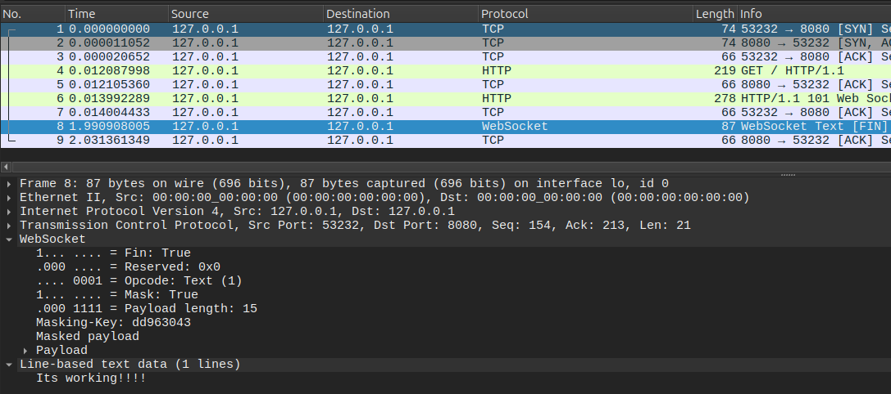

# ZipZip Chat
Um chat em uma rede local de forma segura


## Problema
segurança que as mensagens são criptografadas em uma aplicação de mensagem:

Exemplo de falta de criptografia:



- É possivel ver o conteúdo da comunicação do webSocket.


### Pre-requisitos
- maven

## como rodar
``` 
 mvn package
 java -jar target/zipzipchat-1.0-SNAPSHOT.jar 
 ```
